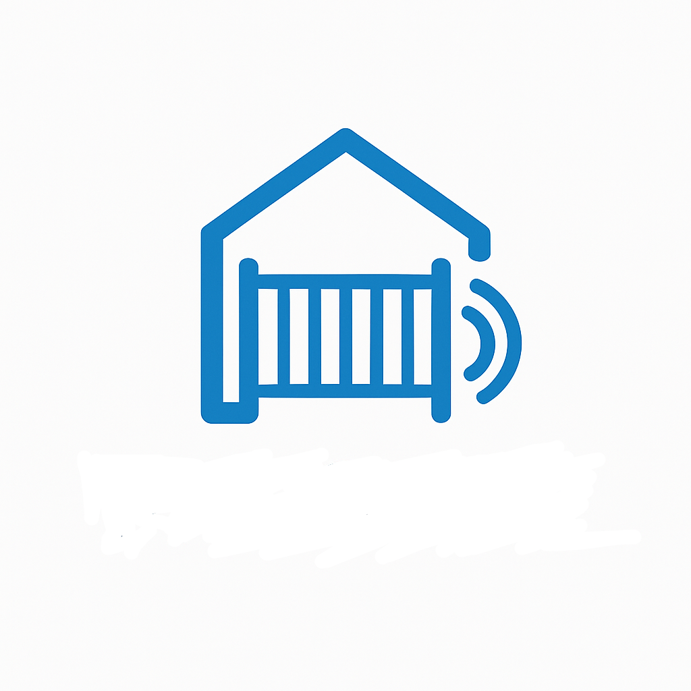

<p align="center">
  
</p>

<h3 align="center">PalGate Gate Opener</h3>

<p align="center">
  An easy way to open your gate.
  <br>
  BLE-triggered automation using ESP32.
</p>

---

## Table of contents
- [What's included](#whats-included)
- [Quick start](#quick-start)
- [Purpose](#purpose)
- [Environment](#environment)
- [Battery runtime estimates](#battery-runtime-estimates)
- [How to extend battery life](#how-to-extend-battery-life)
- [Copyright and license](#copyright-and-license)

---

## What's included
This repository contains two independent PlatformIO projects:

- **/scanner** – ESP32 BLE scanner  
  Detects the user's beacon and triggers the PalGate API via HTTPS.

- **/beacon** – ESP32 BLE iBeacon transmitter  
  Runs on low power and advertises when the user approaches the gate.

Both projects include:
- Clean Arduino-based(ESP32) C++ code  
- Non-blocking BLE scanning  
- Light-sleep integration  
- Configurable UUID, advertising rate, and scan window  

---

## Quick start

1. **Clone the repository**:
   ```bash
   git clone git@github.com:MatanSpada/palgate_gate_opener_esp.git
2. **Open either project (scanner or beacon) in PlatformIO.**
 
3. **Extract your personal PalGate session details**   
You must generate your session token and token type using the QR-code linking process.   
Follow the guide inside the directory: EXTRACT_SESSION_TOKEN/   
- Session token is the permanent authentication key linked to your PalGate account. It is used to generate the temporary request token that actually opens the gate.
4. **Configure your credentials**   
Open the file CONFIG_TEMPLATE.h, fill in the values you obtained and then rename the file to: config.h This file is excluded from Git and is already listed in .gitignore.
5. **Compile and flash the project**   
After the credentials are configured, you can build and upload the firmware normally using PlatformIO.
6. **First boot Wi-Fi provisioning**   
When the ESP32 scanner boots for the first time, it automatically starts an Access Point and opens a Wi-Fi configuration page. The default address is: http://192.168.4.1 (This can be modified in the code).

After entering your Wi-Fi SSID and password, the scanner will store them in NVS (persist storage).

In order to connect the scanner to a different Wi-Fi network and erase the stored credentials from NVS: Press the BOOT button (GPIO0) once. Immediately after that, press the EN (RESET) button to reboot the device.

After the reboot, the ESP32 will start as if it’s booting for the first time: it will create an Access Point and open the Wi-Fi provisioning page, waiting for new SSID and password input.
7. **Testing the system**   
Press the button on the beacon → it will transmit a BLE advertisement. The scanner should detect it and turn on its LED.
You can also open a serial terminal (UART) to the scanner to view logs and debugging messages.

## Purpose
Parking lots often have zero cellular reception, preventing the PalGate app from working.
This project tries to solve it by using two ESP32 units (beacon + scanner) to open the gate reliably even when:
- There is no cellular coverage
- The phone cannot send API requests
- You can place the scanner-esp at a place with reception/wifi.
The scanner detects your beacon and triggers an authenticated request to the PalGate server.

## Environment
- Board: ESP32 (ESP-WROOM-32)
- Framework: PlatformIO + Arduino
- Communication: BLE + Wi-Fi
- Sleep mode: Light Sleep / Deep Sleep (configurable)
- Folders:
/scanner     BLE scanner
/beacon      BLE beacon transmitter

## Battery runtime
Actual runtime depends on:
- Scan window
- Advertising interval
- Wi-Fi reconnect time
- Battery capacity

## How to extend battery life
- Reduce BLE advertising frequency (beacon)
- Lower scan window (SCAN_AWAKE_MS vs SLEEP_MS)
- Use Deep Sleep for the beacon when possible
- Increase Wi-Fi reconnect timeout
- Disable Serial debug logs in production
- Use high-quality Li-ion cells (≥3000mAh)

## Copyright and license
Code released under the MIT License.
Feel free to modify, improve, or use in your own automation projects

